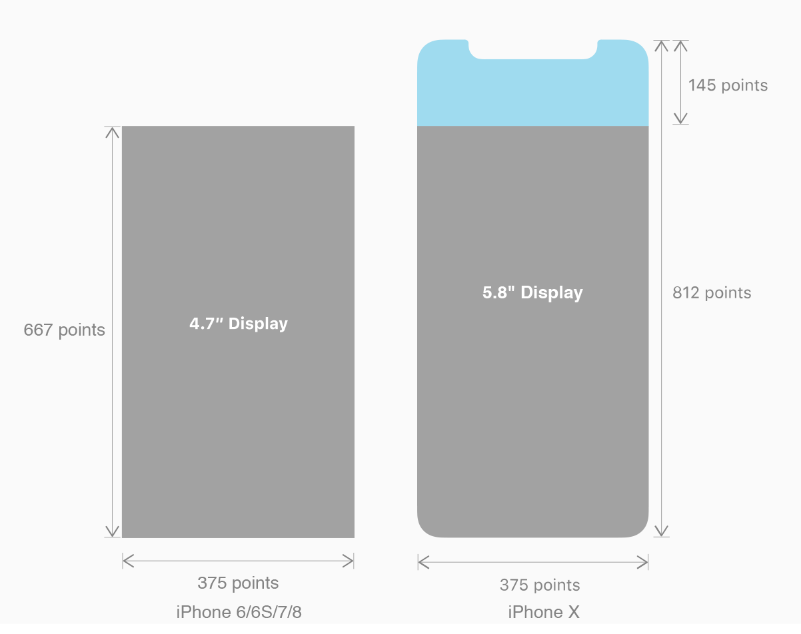
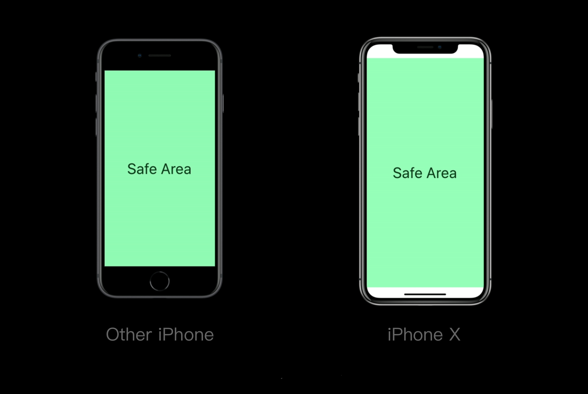
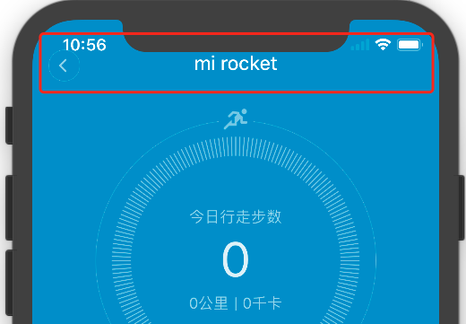
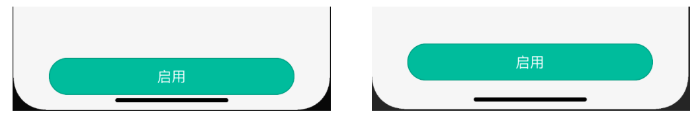

# iPhone X 简易适配指南

#### 变化 

iPhone X 采用 @3X 图，开发尺寸为 **375 * 812** pt。其中 Status Bar 向上延伸至屏幕顶端，延伸高度为 24 pt（即现在 Status Bar高度为 **44** ）；Tab Bar向下延伸至屏幕底部，延伸高度为 34 pt (即现在Tab Bar高度为 **83**)。

#### 适配原则

1，保证设计布局能够填满整个屏幕

2，注意 [Safe Area](https://developer.apple.com/documentation/uikit/uiview/positioning_content_relative_to_the_safe_area)，核心内容不要被设备的圆角、传感器以及底部访问主屏幕的指示灯遮挡

> **对于iPhone X来说，安全区域为除去顶部44pt以及底部34pt之后的其他区域*

####  插件适配

1，请在 [config.plist](../structure/config.plist) 文件中添加 `supportIPhoneX` 字段，类型为 `Boolean` ，值为 `YES`。

2，请根据自家插件的设计制定适配方案，[Human Interface Guidelines](https://developer.apple.com/ios/human-interface-guidelines/overview/iphone-x/) 会是你的好帮手。通常，需要修改的地方有：

- 导航

如果使用 `MHNavigationBar`组件，需要将其下移 24 pt，可参考 `com.xiaomi.demoios` 插件中 [index.ios.js](../com.xiaomi.demoios/Main/index.ios.js) 文件，使用 `marginTop: 24` 来达到此目的。

- 屏幕底部交互控件

如果有靠近屏幕底部的交互，将控件上移到距离底部34 pt 以上的范围内（即安全区域内）。

#### 最后

更多问题可在本项目直接开 [issues](https://github.com/MiEcosystem/ios-rn-sdk/issues/new) 。
