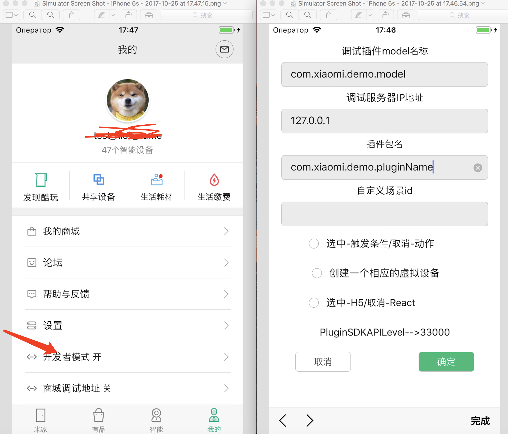

# MiHomePluginSDK

# 目录

- [概要](#概要)
- [功能模块索引](#功能模块索引)
- [示例代码](#示例代码)
- [常见问题](#常见问题)
- [开发环境](#开发环境)
- [扩展程序申请与创建](#扩展程序申请与创建)
- [开始写扩展程序代码](#开始写扩展程序代码)
- [扩展程序包min_api_level的确定](#min_api_level)
- [扩展程序目录结构及文件含义](#扩展程序目录结构及文件含义)
- [智能设备的发现与连接](#智能设备的发现与连接)
- [调试本地扩展程序](#调试本地扩展程序)
- [开发自定义自动化（原智能场景）](#开发自定义自动化)
- [调试本地扩展程序自动化](#调试本地扩展程序自动化)
- [扩展程序的打包和签名](#扩展程序的打包和签名)
- [扩展程序的测试和发布](#扩展程序的测试和发布)
# 概要
此项目为方便智能硬件接入小米米家 App（ iOS 版本）。基于此方案，智能硬件厂商需要开发自己的米家扩展程序，用户使用米家 App 连接硬件之后，会自动下载、使用扩展程序，获得与设备交互的能力与 UI。米家 iOS 客户端的扩展程序基于 [React Native](https://facebook.github.io/react-native/) 框架实现，并融合了 [JSPatch](http://jspatch.com) 的一些功能(已暂时弃用)，可以实时动态更新，同时最大限度保留了原生 App 的体验。

**React Native 引擎版本：0.25.1**

**当前 API Level ：131**

**兼容性：iOS 9 +**

注：从米家 App 4.4.0 版本起，放弃支持 iOS 8。

# 功能模块索引

- [config.plist 配置项含义](./MiHomePluginSDK/docs/config.md)
- [MHPluginSDK 模块文档](./MiHomePluginSDK/docs/MHPluginSDK.md)
- [MHBluetooth 模块文档](./MiHomePluginSDK/docs/MHBluetooth.md)
- [MHBluetoothLE 模块文档](./MiHomePluginSDK/docs/MHBluetoothLE.md)
- [MHMiotStore 模块文档](./MiHomePluginSDK/docs/MHMiotStore.md)
- [MHXiaomiBLE 模块文档](./MiHomePluginSDK/docs/MHXiaomiBLE.md)
- [MHPluginFS 模块文档](./MiHomePluginSDK/docs/MHPluginFS.md)
- [MHMapSearch 模块文档（高德地图）](./MiHomePluginSDK/docs/MHMapSearch.md)
- [MHAudio 模块文档（音频）](./MiHomePluginSDK/docs/MHAudio.md)
- [使用 MHJSPatch 辅助开发扩展程序](./MiHomePluginSDK/docs/MHJSPatch.md) （暂时弃用）
- [扩展程序的多语言化](./MiHomePluginSDK/docs/localization.md)
- [使用 React Native 第三方开源组件](./MiHomePluginSDK/docs/library.md)
- [扩展程序页面和组件代码说明](./MiHomePluginSDK/docs/code.md)
- [widget配置说明](./MiHomePluginSDK/docs/widgetConfig.md)
- [rn升级蓝牙设备固件的说明文档](./MiHomePluginSDK/docs/blernfirmwareupdate.md)
- [rn开发非小米协议蓝牙设备说明文档](./MiHomePluginSDK/docs/bleScanOCEmbed.md)
- [rn借助chrome进行调试文档](./MiHomePluginSDK/docs/rn-chrome-debug.md)
- [扩展程序的生命周期说明文档](./MiHomePluginSDK/docs/lifeCycleDiscussion.md)
- [iPhone X 适配指南](./MiHomePluginSDK/docs/updatePluginsForiPhoneX.md)
- [插件支持蓝牙网关说明](./MiHomePluginSDK/docs/btGateway.md)

#  示例代码 

`MiHomePluginSDK` 目录中包含一系列示例代码，开发者可作为参考：

- wifi 设备开发板示例程序，SDK 目录中 com.xiaomi.demoios 
- 支持小米协议的蓝牙设备开发示例程序，SDK 目录中 com.xiaomi.bledemo.ios 目录
- 一个完整的真实 wifi 设备程序，SDK目录中 com.xiaomi.powerstripdemo.ios 目录
- 一个支持横竖屏切换展示的示例程序，SDK目录中 com.xiaomi.orientationdemo.ios 目录
- 一个应用SVG组件的示例程序，SDK目录中 com.xiaomi.svgdemo.ios 目录
- 一个有关React Native ART动画的示例程序，SDK目录中 com.xiaomi.artanimdemo.ios 目录，更多 ART 的 API 请参考[此处](https://github.com/react-native-china/react-native-ART-doc/blob/master/doc.md)
- 一个粒子系统的示例程序，SDK目录中 com.xiaomi.particledemo.ios 目录
- 支持米家安全芯片的蓝牙设备开发示例程序，SDK目录中com.xiaomi.corebledemo.ios 目录

## 常见问题

我们收集了诸多开发者关心的问题，整理后放在了 [WiKi](https://github.com/MiEcosystem/ios-rn-sdk/wiki)。更多问题请大家给本项目直接提[issues](https://github.com/MiEcosystem/ios-rn-sdk/issues/new)。

## 开发环境

1. [React Native](https://facebook.github.io/react-native/)（以下简称RN）: RN 的安装过程参见该项目主页。**注意** 目前米家 iOS 客户端中内置的 RN 引擎版本为 **0.25.1**。MiHomePluginSDK 中已经携带，开发机上安装的 RN 版本并不影响扩展程序的开发，0.25.1以后版本RN的新功能暂时不能使用。
2. MiHomePluginSDK: SDK可以通过 [Github项目主页](https://github.com/MiEcosystem/ios-rn-sdk) 下载。
3. openSSL: 为了保证扩展程序包在网络传输中的安全，防止伪造，扩展程序包需要经过开发者签名，签名过程需要 keyTool (OS X 自带) 以及 openSSL 工具。可以通过 [Homebrew](http://brew.sh) 进行安装:

   ```
   brew install openssl
   ```
4. iPhone真机: 由于要使用 Appstore 版本的米家APP进行调试(如果想获得调试便利，需要向米家工作人员要一个debug版本的米家ipa，rn 的调试选项在 release 模式下禁用了)，所以不能使用模拟器开发，必须使用一部 iOS 8.0 以上系统的 iPhone 真机。

## 扩展程序申请与创建

1. 在 [小米 IoT 开发者平台 ](https://iot.mi.com)上注册一个开发者账号（智能设备硬件、iOS 扩展程序、android 扩展程序使用同一个开发者账号）并等待审核通过。
2. 创建智能设备的扩展程序。创建程序的过程中需要填写一个程序包名，命名规则一般为：若开发者标识为 *aaa*，设备 model 为*aaa.bbb.v1*，则 iOS 拓展程序包名一般为 *com.aaa.bbb.ios* 。例如，*xiaomi* 公司开发了一款火箭筒，设备 *model* 为 *xiaomi.rocketlauncher.v1*，则该火箭筒在米家iOS客户端中的扩展程序包名为 *com.xiaomi.rocketlauncher.ios*

## 开始写扩展程序代码

1. 进入 MiHomePluginSDK 所在目录
2. 运行 createPlugin 脚本创建一个新的本地扩展程序包：

   ```
   ./createPlugin plugin_name
   ```

   其中 plugin_name 即为之前申请创建的扩展程序包名 com.aaa.bbb.ios

3. 本地扩展程序包创建成功后，会在 SDK 所在目录下生成一个 plugin_name 目录，其目录结构以及各文件的含义见相关章节。
4. plugin_name 目录下有个名为 packageInfo.json 的扩展程序包信息文件（**注意** 不要与 npm 的 package.json 混淆）。这个文件关系到程序包的打包和上传，创建本地程序包成功后，请用文本编辑器打开这个文件并编辑其中的内容：

   ```js
   {
    "package_name":"com.aaa.bbb.ios", // 包名，不用修改
    "developer_id":"123456789", // 开发者账号小米ID
    "models":"aaa.bbb.v1|your_device_model2", // 扩展程序支持的设备model，一个程序包可以支持多个model，用|分割
    "min_api_level":"11", // 扩展程序包代码中用到的最高Level的API的API_Level，详见"扩展程序包min_api_level的确定"章节
    "version":"1", // 包的版本，每个上传的程序包都要不同且递增，每次上传新的程序包之前都需要修改
    "platform":"iphone" // 程序包支持的平台，目前只支持iphone，不用修改
   }
   ```

   **注意**：每次打包上传扩展程序包时，都要检查 version 字段是否递增。

## min_api_level

1. 米家 iOS 客户端的功能随着版本的变化也在发生变化，开放给扩展程序的 API 也在逐渐增加（极少数情况下也会废弃），每一个版本的客户端都有一个 API_Level，代表了客户端支持的 API 集合，随版本升高和 API 的引入而增加。
2. 每个模块或 API 的文档中标明了其引入时米家 iOS 客户端的 API_Level，例如 AL[7,] 表示这个模块或 API 只有在运行的客户端 API_Level >= 7 的情况下才可以使用，若运行在旧版本的米家客户端，则有可能造成 crash。（ API 未标明 Level 的默认与该 API 所在模块的 Level 一致）。
3. 扩展程序包的 min_api_level 为整个扩展程序中所使用的所有 API 中 API_Level 最高的一个，API_Level 低于 min_api_level 的米家APP将无法获取到此扩展程序，默认情况下 min_api_level 为当前 SDK 的 SDK_API_Level（该 SDK 中所有 API 里 API_Level 最高的一个）。

## 扩展程序目录结构及文件含义

本地扩展程序包目录下包含以下文件和目录：

1. packageInfo.json: 扩展程序包信息文件。
2. config.plist: 扩展程序配置文件。该文件包含了一些扩展程序可以配置的配置项，包括扩展程序设备状态轮询时间间隔等，具体参见“config.plist配置项含义”章节
3. Main目录：扩展程序的页面，其中 index.ios.js 为入口，用 Navigator 导航，可包含多个页面，具体界面开发参见RN文档。设备功能开发参见”与设备和米家云端的交互“章节。**注意** 相对于1.x版本的旧结构，2.x版本SDK创建的新扩展程序的所有页面都在js侧完成，设置页、自定义场景页和主页面合并为同一个 bundle。导航栏也可以自由控制和隐藏，app 侧不再做强制还原。详见“扩展程序页面和组件代码说明”文档
4. Resources目录：扩展程序包资源目录。所有扩展程序包用到的资源，例如图片、文本、声音等文件都要存储在这个目录下。注意，通过require方式加载的资源图片，不要放在这个目录下，否则会copy两份到打包的扩展程序包中，require方式加载的资源图片放在Assets目录中
5. Assets目录：存放通过require方式加载的资源
6. JSPatch目录：所有扩展程序用到的JSPatch脚本文件存储在这个目录下。</strike>

## 智能设备的发现与连接

1.  米家 iOS 使用 appstore 版本的客户端（或者debug版本的ipa）进行智能设备扩展程序的开发与调试，在开发与调试之前，需要将设备连接到米家 iOS 客户端中。目前支持使用以下几种设备进行 iOS 扩展程序的开发和调试：

    1. 已经接入米家android的智能设备
       2. 正在开发的米家设备开发板
       3. 小米智能设备Demo开发板
       4. 任意已经接入米家iOS的设备
       5. 虚拟设备

    其中，3、4和5由于不具备待开发设备的相应功能，只能用来开发UI界面。

2. 使用1和2进行 iOS 扩展程序开发时，需要将 iOS 的产品状态设置为白名单可见，不然无法在客户端的快连菜单和设备列表里看到设备。

3. 使用米家开发者账号登陆 iOS 客户端
4. 点击客户端右上角的"+"，如果菜单中并未出现要连接的设备型号，请按如下步骤操作：

    1. 确认已按前述步骤2联系米家工作人员设置产品状态。
       2. 退出登录开发者账号、杀死客户端进程并重新使用开发者账号登陆。

5. 在菜单中选择要连接的设备型号，按客户端提示进行连接。
6. 如果连接失败。请按照指示灯的状态选择对应的模式再试一次，**注意** 设备不支持工作在 5G wifi 下。（一般是选用兼容模式再试）
7. 当设备出现在设备列表以后，即可进行扩展程序的开发和调试工作。
8. 虚拟设备的创建流程见下节。

## 调试本地扩展程序

1.  使用米家开发者账号登陆米家 iOS APP ，并确保智能设备（或虚拟设备）已经出现在设备列表中，若有疑问，参见“智能设备的发现与连接”章节。

2. 进入 MiHomePluginSDK 所在目录。

3. 启动 node 服务器：

           ```
           npm start --reset-cache
           ```
          
           **注意** 如果出现错误，请检查 node 与 npm 是否已经正确安装。

4. 查看本机 IP 地址：

           ​```
           ifconfig en0
           ​```
          
           **注意** 请确保电脑与手机处在同一局域网内，不然无法调试。

5. 客户端切换到个人信息页卡，检查是否出现“开发者选项”。如果并没有出现，请按如下步骤重试：

    1. 参考 扩展程序的打包和签名 章节，在小米 IoT 开发者平台，填入米家扩展程序公钥。
    2. 如果已填入公钥，重启 App，登出再登入账号。

6. 开启“开发者选项”，在弹出的对话框中按要求输入调试扩展程序的信息：

    如图：

    1. 设备 model ：调试设备的 model，符合该 model 的设备将加载本地扩展程序，可以是任意设备。
    2. 调试服务器 IP ：前述步骤4中记下的电脑 IP 地址。
    3. 扩展程序包名：欲调试的扩展程序包名 plugin_name。
    4. 自定义场景id（可选）：如果要开发自定义场景，这里填写对应的sc_id（条件）或sa_id（动作）。一次只支持一个条件/动作的调试。
    5. 触发条件/动作：开发的自定义场景是条件还是动作，如果选中，代表调试的是条件，4中为sc_id；如果未选中，代表调试的是动作，4中为sa_id。
    6. 创建一个对应的虚拟设备：如果没有实体智能设备进行调试，也可以勾选此项，会在设备列表里加入一个虚拟的设备，此设备model与选项1中设置的设备model相同。但并不具备实际功能，无法接收RPC指令并做出响应。并且，该model必须是一个已上线或在白名单中的model，不然不会出现在设备列表中，例：xiaomi.demo.v1

7. 点击“确定”按钮完成设置。

8. 在设备列表中单击对应设备，弹出 Alert 提示"当前设备model与开发者模式设置的model匹配，将与IP为xxx的调试服务器通信获取扩展程序进行调试"。表示匹配成功，APP 将会访问电脑上的扩展程序包进行展示。

9. 如果需要查看本地调试扩展程序输出的 console.log 信息，可以用 XCode 连接 iPhone，Command+Shift+2 打开 Devices 菜单并选择该 iPhone，之后可以在右侧区域看到 React 通过应用 MiHome 输出的的调试信息，以[REACT]开头。

10. 扩展程序代码错误不会导致APP崩溃，而是会弹出一个页面提示错误原因，并可以勾选将错误日志上报。当扩展程序正式上线后，可以在米家开放平台看到用户上报的扩展程序崩溃日志。

## 开发自定义自动化
MiHomePluginSDK 支持自定义自动化的开发（支持自定义场景条件或动作页面），具体步骤如下：

1. 在扩展程序包的 config.plist 里，用 customSceneTriggerIds或 customSceneActionIds 的 key 指明该扩展程序包支持哪些自定义智能场景条件或动作的 sc_id/sa_id 字符串。**注意** 如果不清楚sc_id和sa_id的含义，请与米家工作人员联系。
2. 在扩展程序主目录下的 Main目录下进行自定义智能场景页面的开发(SceneMain.js文件)，该页面会在用户点击“个人中心” --> “自动化” --> “添加” --> “步骤一：添加触发条件”或“步骤二：添加执行任务”并选中相应设备和动作后进入。
3. 该页面的目的是引导用户完成对该自定义自动化条件/动作的额外设置。（比如展示一个调色板并让用户选择符合场景触发条件时将灯泡设置成的目标颜色，或展示一个温度选择列表并让用户选择特定温度作为温度传感器的触发条件等）
4. 完成设置后，需要调用API将设置好的trigger或action字典传回：

   ```js
   // 如果是开发自定义触发条件
   MHPluginSDK.finishCustomSceneSetupWithTrigger(trigger);
   // 如果是开发自定义动作
   MHPluginSDK.finishCustomSceneSetupWithAction(action);

   ```

## 调试本地扩展程序自动化
1. 参见“调试本地扩展程序”章节，完成电脑和手机上的设置，并在开发者选项中设置自定义自动化sc_id(开发条件）或sa_id（开发动作）以及相应checkbox。
2. 点击个人中心页中的自动化，添加场景，选择步骤一：触发条件或二：添加任务。
3. 单击对应设备的对应动作，如果sc_id或sa_id匹配，则会读取电脑上的扩展程序进行调试。

## 扩展程序的打包和签名

##### 准备扩展程序签名文件
1. 使用 keytool 工具生成属于米家开发者账号的 keystore 证书文件。 **注意** 此文件 iOS 与 android 通用并且需要保持一致，如果已经开发过 android 扩展程序，请使用当时生成的 keystore 文件，并跳过步骤1和2。

   ```shell
   keytool -genkey -dname CN=YourName,OU=YourCompany,O=YourCompany,L=Beijing,ST=Beijing,C=86 -alias yourKeyAlias -keypass 123456 -storepass 123456 -keystore ./your.keystore -validity 18000 -keyalg RSA -keysize 2048
   ```

2. 在[小米 IoT 开发者平台](https://iot.mi.com/developer#/personal)，个人开发者选项中，填入公钥。即 keystore 文件的证书 MD5 指纹：

   ```shell
   keytool -list -v -keystore your.keystore
   ```

   取出其中的 MD5 指纹并去掉冒号；

3. 使用 keystore 文件按照下述流程提取出 iOS 能够识别的公钥和私钥文件；

4. 导出公钥文件 public.cer ：

   ```shell
   keytool -export -keystore your.keystore -alias yourKeyAlias -file public.cer
   ```

   其中 yourKeyAlias 与生成 keystore时的同名参数保持一致。如果是安卓生成的，可以通过下面的命令来查看设置的别名。

   ```shell
   keytool -list -keystore your.keystore
   ```

5. 导出私钥 pem 文件 private.pem: 

   ```shell
   //1
   keytool -importkeystore -srckeystore your.keystore -destkeystore private.pkcs -srcstoretype JKS -deststoretype PKCS12 -alias yourKeyAlias

   //2
   openssl pkcs12 -in private.pkcs -out private.pem
   ```

6. 保留好生成的 public.cer 以及 private.pem，扩展程序包签名时将用到这两个文件。

##### 打包并给扩展程序签名
1. 修改本地扩展程序包的 packageInfo.json 一般是将上一次成功上传的 version + 1，并确定 min_api_level 等其他信息是否填写正确；
2. 进入 MiHomePluginSDK 目录；
3. 运行 packagePluginAndSign 脚本进行打包：

   ```python
   python packagePluginAndSign plugin_name /path/to/private.pem /path/to/public.cer yourDeveloperId
   ```

   其中 plugin_name 是扩展程序包的目录名，private.pem 和 public.cer 分别是准备好的私钥和公钥文件，yourDeveloperId 是开发此扩展程序的米家开发者账号（数字小米ID）


4. 签名过程中会要求输入私钥文件的密码；
5. 打包成功后会在当前目录下生成 plugin_name.signed.zip 的已签名扩展程序包；
6. 用开发者账号登录 [小米 IoT 开发者平台](https://iot.mi.com/)，在扩展程序管理里选择相应的 iOS 扩展程序，点击“上传扩展程序包”进行上传；
7. 成功后点击该扩展程序包的“白名单测试”，即可用 AppStore 版本的客户端下载在白名单范围内下载到此扩展程序进行测试。

## 扩展程序的测试和发布
1. 扩展程序开发者应在开发环境下进行充分的代码测试；
2. 上传扩展程序，在对应版本后点击 “白名单测试” 按钮， 则白名单内的用户能下载和测试扩展程序。注意云端一般会有几分钟的缓存刷新时间，可能无法立即生效。尤其用户第一次被添加入白名单时，最好重新登录账号并重启 App。厂商需要利用白名单测试做好上线前测试；
3. 厂商测试完毕，在对应版本后点击“申请上线”按钮，提交测试报告，等待审核；
4. 审核通过，正式上线。
