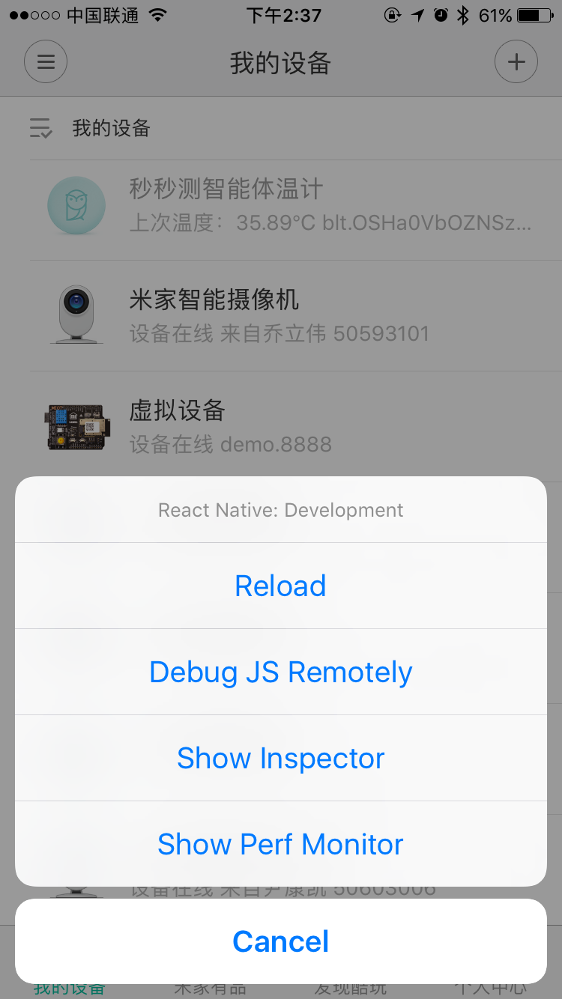

#  使用chrome辅助调试插件代码

- rn的调试菜单在release模式下禁用了，所以用App Store版本无法调试，需要使用debug版本的米家app，可以通过联系米家工作人员获得
- 在开发者模式设置好配置，如下图
  
- 在设备列表页摇一摇，打开远程调试js代码选项，千万不要进入插件页再打开（有bug，红屏）
  
- 打开远程调试js代码选项后，会自动打开Mac上的chrome一个网页
  
- 打开chrome开发者模式（Mac上是**Command**`⌘` + **Option**`⌥` + **I**）即可进行调试，具体可以参照rn文档
- 准备工作就绪，进入插件页，可以在chrome中看到log
  

  或者加断点进行调试
  